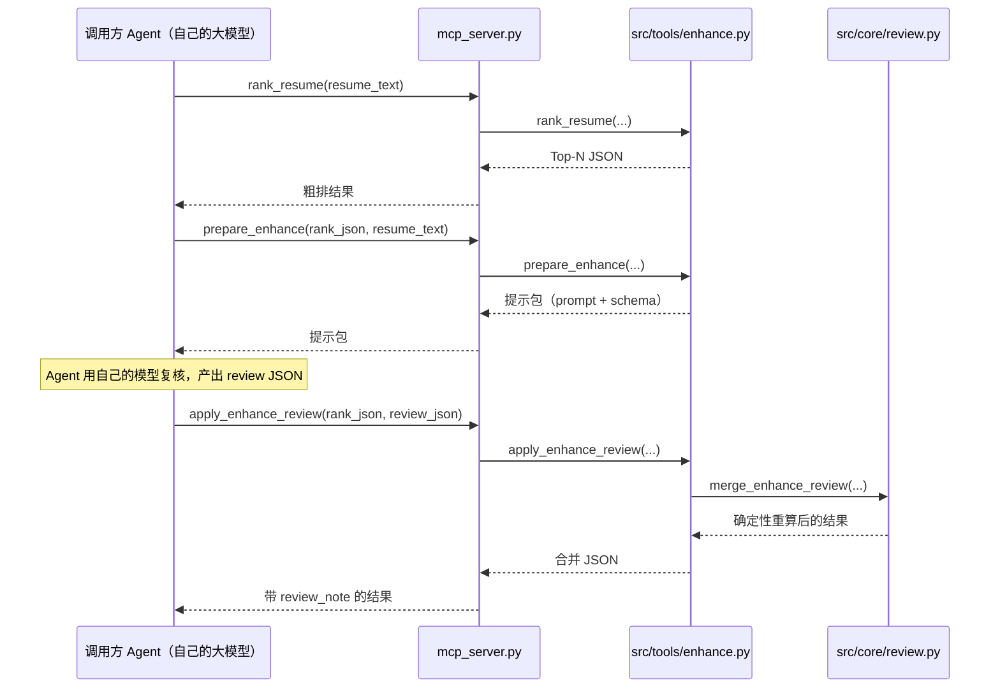

# 01 入口层：三个入口怎么接入同一套业务

项目有**三个入口**，但业务逻辑只有一份（`src/tools/`）。入口层是"薄壳"：
只负责参数解析、格式转换、调用工具、序列化返回。

| 入口 | 文件 | 给谁用 | 是否调 LLM |
|------|------|--------|------------|
| MCP Server | `mcp_server.py` | Claude Desktop / Codex / Cursor 等 Agent | 否（Agent 用自己的模型） |
| CLI | `src/main.py` | 命令行 / 脚本 | 是（enhance/analyze/modify/extract-resume） |
| HTTP API | `api_server.py` | 前端联调 | 是（extract/enhance/gap/modify） |

---

## 1. MCP 入口：mcp_server.py

### 1.1 启动时做了三件事

```python
sys.path.insert(0, str(Path(__file__).resolve().parent))  # 让 `import src` 生效
load_dotenv(Path(__file__).resolve().parent / ".env")     # 加载根目录 .env
try:
    from mcp.server.fastmcp import FastMCP, Image         # mcp SDK 1.x
    _ServerCls = FastMCP
except ImportError:                                       # mcp SDK 2.x
    from mcp.server.mcpserver import MCPServer, Image
    _ServerCls = MCPServer
```

要点：

- **源码运行**：项目不打包（`pyproject.toml` 里 `packages = []`），运行时直接把
  项目根目录塞进 `sys.path`，这样 `from src.tools.rank import ...` 才能找到。
- **加载 .env**：虽然 MCP 模式不调 LLM，但 CLI 子命令和后续可能需要
  `STORE_BACKEND`，所以统一加载。
- **SDK 版本兼容**：mcp 1.x 和 2.x 的类名不同（`FastMCP` vs `MCPServer`），
  但用法一致，所以用 `try/except` 二选一，避免环境差异导致启动失败。

### 1.2 注册了两个静态资源

```python
@mcp.resource("dimensions://seven")
def dimensions_resource() -> str: ...

@mcp.resource("dimensions://category-map")
def category_map_resource() -> str: ...
```

这两个资源是给调用方 Agent **参考用的"字典"**：七维定义、图谱 category 到七维
key 的映射。Agent 拿到后知道每个维度是什么意思，复核/提取时不会乱造维度。

### 1.3 注册了 9 个工具——全部是"一行转发"

以 `rank_resume` 为例：

```python
@mcp.tool()
def rank_resume(resume_text: str, topk: int = 10, use_idf: bool = False) -> dict:
    return _rank_resume(resume_text, topk=topk, use_idf=use_idf)
```

所有工具模式相同：**接收 JSON 字符串 → `json.loads` → 转发给 `src/tools/` 里的
同名函数**。返回的 PNG（`visualize_radar`）用 MCP SDK 的 `Image(path=...)` 包装，
这样对话界面可以直接渲染图片。

这里有一个容易困惑的点：为什么 `prepare_enhance` 要接收 `rank_json: str` 而不是
直接接收 dict？因为 MCP 工具协议的入参本质是 JSON，str 传输最稳；收到后再
`json.loads` 还原成 Python dict 转发给工具层。

### 1.4 MCP 模式的完整调用链（以语义复核为例）



注意：服务器**从不**调用 `call_llm_json`。LLM 推理永远发生在"发起调用的一方"。
这就是 MCP 模式不需要 API Key 的原因。

---

## 2. CLI 入口：src/main.py

### 2.1 五个子命令，一个全局参数

```text
python src/main.py rank -r 简历.pdf --topk 10
python src/main.py enhance -r rank_result.json --resume 简历.pdf --topk 20
python src/main.py analyze -r role.json --resume 简历.pdf
python src/main.py modify -r role.json --resume 简历.pdf
python src/main.py extract-resume -i resumes/ -o resume_profiles.json --workers 4
```

全局 `--store memory|neo4j` 可覆盖 `STORE_BACKEND` 环境变量；`extract-resume`
还有 `--provider` 可临时切换 LLM 供应商（A/B 对比用）。

### 2.2 每个命令做了什么

**rank**：读简历文件 → 转 Markdown → 创建 store → `rank_resume` → 打印 JSON。

```python
resume_text = _read_resume(args.resume)                       # 文件 → 文本
store = create_store(args.store or os.environ.get("STORE_BACKEND") or "memory")
result = rank_resume(resume_text, topk=args.topk, store=store)
```

**enhance**：读 rank 结果 JSON → `enhance_matches`（这里会调 LLM）→ 可选
`--analyze` 时把复核后的第 1 名直接接差距分析。

```python
result = enhance_matches(rank_result, resume_text, topk=args.topk)
if args.analyze and result.get("results"):
    gap = analyze_gap(result["results"][0], resume_text)      # 复核后第 1 名
    result = {"enhanced": result, "gap_analysis": gap}
```

一个细节：`--analyze` 用的是**复核后**的第 1 名，保证两阶段数据一致
（复核修正过的命中明细直接喂给差距分析）。

**analyze**：读单个 role JSON → `analyze_gap`（LLM）→ 输出
`{analysis, markdown, report}` 三个视角的产物。

**modify**：读 role JSON（兼容 rank 结果文件，自动取 `results[0]`）→
`suggest_resume_edit`（LLM）→ 输出建议。

**extract-resume**：批量提取 7 维画像，这是 CLI 独有的并发功能：

```python
result = extract_resume_batch(
    items, position=args.position,
    max_workers=args.workers,          # 默认 4 线程并发调 LLM
    progress_cb=_progress if args.workers > 1 else None,
)
```

输出除了每份简历的画像，还带 `ok/failed/coverage` 统计（每维覆盖了多少份简历），
方便评估批量提取质量。

### 2.3 CLI 与 MCP 口径一致

CLI 的 `enhance_matches` 在 LLM 返回复核结果后，会调用 `apply_enhance_review`
做与 MCP 模式完全相同的合并与确定性重算：**忽略模型自报 score，按
「加权覆盖率 × 少条目惩罚」重算分数**。两种模式唯一的区别只剩"LLM 由谁调用"
（CLI 自己调、MCP 由调用方 Agent 调），分数口径完全一致。

---

## 3. HTTP 入口：api_server.py

FastAPI 封装，8 个路由，全部复用 `src/tools/`：

| 方法 | 路径 | 调 LLM | 说明 |
|------|------|--------|------|
| GET | `/health` | 否 | 健康检查：数据源、岗位数、LLM 是否配置 |
| POST | `/upload` | 否 | 文件 → Markdown（临时文件用完即删） |
| POST | `/extract` | 是 | 简历 → 7 维画像 |
| POST | `/rank` | 否 | 粗排 |
| POST | `/enhance` | 是 | 语义复核 |
| POST | `/gap` | 是 | 差距分析 |
| POST | `/modify` | 是 | 修改建议 + 防造假校验 |
| POST | `/radar` | 否 | 雷达图 PNG |

几个值得注意的实现点：

1. **统一异常映射**：`ValueError` → 400（参数/配置错），`RuntimeError` → 500
   （LLM 失败/数据源异常），前端拿到结构化错误。
2. **/upload 用临时文件**：上传文件写入系统临时目录 → markitdown 转换 →
   `finally` 里删除，不落盘残留。
3. **/modify 把两步串起来**：`suggest_resume_edit` 生成建议后立刻
   `validate_resume_edit` 校验，`result["validation"]` 一并返回——LLM 产出一出来
   就先过"安检"再给前端。
4. **CORS 全开**：`allow_origins=["*"]`，本地联调方便，部署时需收紧。

## 4. 三个入口的共性：为什么业务能"一份代码三处用"

因为 `src/tools/` 的函数都是**普通 Python 函数**，不绑定任何平台：

- MCP 装饰器包一层 → MCP 工具；
- argparse 包一层 → CLI 命令；
- FastAPI 路由包一层 → HTTP 接口。

以后要加新入口（比如 WebSocket 服务），只需要再包一层壳，业务零改动。
这也是整个项目最容易理解、也最容易受益的架构决策。
