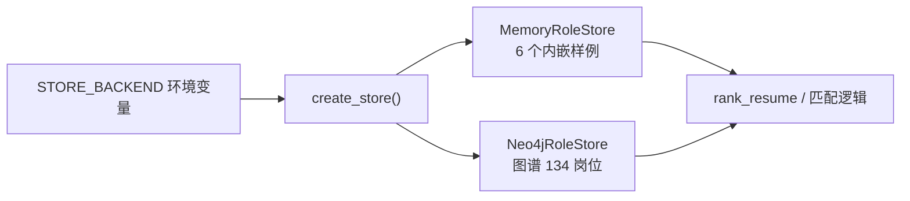

# 02 数据层：岗位数据从哪来

匹配引擎的"知识库"是一组**标准岗位（Role）**：每个岗位带岗位名、分类、JD 数量，
以及一张核心技能清单。数据层负责把这些岗位以统一结构喂给匹配逻辑。

---

## 1. 先看数据契约：Role 长什么样

`src/store/interface.py` 的注释写明了契约，一个 Role 是这样的：

```json
{
  "role_name": "大模型算法工程师",
  "family_name": "算法",
  "domain_name": "AI",
  "jd_count": 3,
  "skills": [
    {"name": "大语言模型", "category": "知识", "weight": 2.0, "rank": 1},
    {"name": "PyTorch", "category": "技术", "weight": 2.0, "rank": 5},
    {"name": "硕士及以上学历", "category": "任职条件", "weight": 1.5, "rank": 13}
  ]
}
```

四个技能字段的含义：

| 字段 | 含义 | 来源 |
|------|------|------|
| `name` | 技能名（如"PyTorch"） | 图谱 `NormalizedSkill.canonical_name` |
| `category` | 图谱分类（知识/技术/任职条件/招聘偏好/动机/特质/自我概念） | 图谱技能节点 |
| `weight` | 该技能对该岗位的重要度（JD 支持度） | 图谱边 `HAS_CORE_SKILL.final_score` |
| `rank` | 在岗位技能清单里的排序 | 图谱边 `HAS_CORE_SKILL.rank` |

`weight` 是整个打分体系的核心：**命中一个高权重的技能比命中多个低权重技能更值
钱**。这就是"加权覆盖率"而非简单命中率的原因。

## 2. 抽象接口：RoleStore

```python
class RoleStore(ABC):
    @abstractmethod
    def get_all_roles(self) -> List[Dict[str, Any]]: ...

    @abstractmethod
    def get_role_by_name(self, name: str) -> Optional[Dict[str, Any]]: ...
```

只有两个方法：拿全部、按名精确查一个。匹配代码只依赖这两个方法，**完全不 care
数据是内存里写死的还是从 Neo4j 查出来的**。

## 3. 实现一：MemoryRoleStore（默认，开箱即用）

`src/store/memory_store.py` 内嵌了 **6 个示例岗位**，用一个小工具函数构造技能：

```python
def _skills(*items: tuple) -> List[Dict[str, Any]]:
    """构造技能列表：("技能名", "类别", 权重, 排名)。"""
    out = []
    for rank, (name, category, weight) in enumerate(items, start=1):
        out.append({"name": name, "category": category,
                    "weight": float(weight), "rank": rank})
    return out
```

这样 `_SAMPLE_ROLES` 里每行只写 `("大语言模型", "知识", 2.0)`，避免重复手写
`{"name": ..., "category": ..., "weight": ..., "rank": ...}` 四件套。

这个实现的定位是**演示 / CI / 测试**：不装 Neo4j 也能跑通整条流水线，且结果
可复现（测试不触网）。注意 `get_all_roles` 返回 `[dict(role) for role in ...]`
（浅拷贝），防止调用方改坏内嵌数据。

## 4. 实现二：Neo4jRoleStore（真实图谱，134 个岗位）

`src/store/neo4j_store.py` 从图谱查数据，核心是一条 Cypher：

```cypher
MATCH (role:Role)-[edge:HAS_CORE_SKILL]->(skill:NormalizedSkill)
OPTIONAL MATCH (jd:JD)-[:INSTANCE_OF]->(role)
WITH role, edge, skill, count(DISTINCT jd) AS jd_cnt
ORDER BY role.role_name, edge.rank
RETURN role.role_name AS role_name, role.family_name AS family_name,
       role.domain_name AS domain_name, jd_cnt,
       collect({name: skill.canonical_name, category: skill.category,
                weight: coalesce(edge.final_score, 0.0),
                rank: coalesce(edge.rank, 9999)}) AS skills
```

逐句理解：

- `MATCH (role)-[edge:HAS_CORE_SKILL]->(skill)`：找到"岗位 → 核心技能"边，
  边上有 `final_score`（权重）和 `rank`（排序）。
- `OPTIONAL MATCH (jd)-[:INSTANCE_OF]->(role)`：再统计每个岗位有多少条 JD 实例
  （`OPTIONAL` 保证没有 JD 的岗位也返回，`count(DISTINCT jd)` 去重计数）。
- `collect({...})`：把同一个岗位的所有技能聚合成一个数组——正好对应
  Role 契约里的 `skills` 列表。
- `coalesce(edge.final_score, 0.0)`：图谱里权重可能为空，兜底成 0。

构造函数要求 `NEO4J_PASSWORD`，缺了就抛异常提示改用 memory。这是显式的
fail-fast：配错了就别假装能用，避免运行时才发现连不上。

> 一个实现细节：`get_role_by_name` 是"遍历全部再比对"，没有用索引查单个。
> 对当前规模（134 个岗位）无所谓，是"简单优先"的取舍。

## 5. 工厂：create_store

```python
def create_store(backend: str = "memory") -> RoleStore:
    if backend == "neo4j":
        return Neo4jRoleStore()
    if backend == "memory":
        return MemoryRoleStore()
    raise ValueError(f"未知 STORE_BACKEND: {backend}")
```

调用方只写 `create_store(os.getenv("STORE_BACKEND", "memory"))`，完全不感知具体
实现。以后加 `csv` / `sqlite` 后端，只需要新增一个类并在这里加一行分支。

这就是**依赖倒置**：高层（工具层）依赖抽象（`RoleStore`），不依赖具体实现；
具体实现反过来可以随便换。

## 6. 数据层在业务流里的位置



`rank_resume` 只调 `store.get_all_roles()` 和 `store.get_role_by_name(name)`。
数据从哪来、怎么查，对匹配逻辑完全透明。

