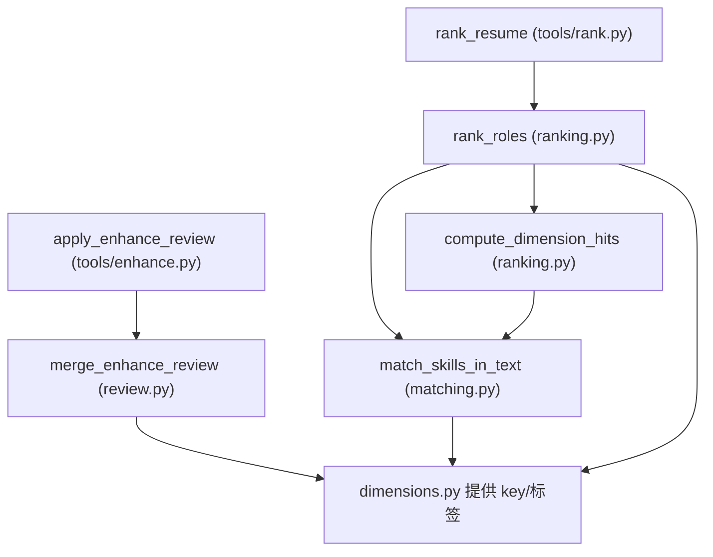

# 03 核心匹配：命中判定、打分公式、复核合并

这是项目**技术含量最高**的一层（`src/core/`）：全部是纯函数、零外部依赖，
`tests/` 可以直接单测。理解这一层，就理解了整个产品的评分口径。

四个文件各管一件事：

| 文件 | 职责 |
|------|------|
| `dimensions.py` | 七维口径定义、category ↔ 七维 key 映射、7→5 投影 |
| `matching.py` | 文本归一化、技能是否"命中"的判定 |
| `ranking.py` | 加权覆盖率打分、排序、IDF 重加权 |
| `review.py` | 语义复核结果合并、确定性重算分数 |

---

## 1. dimensions.py：口径的"宪法"

```python
DIMENSION_KEYS = ("knowledge", "skill", "qualifications",
                  "preference", "motivation", "trait", "self_concept")

CATEGORY_TO_DIM = {
    "知识": "knowledge", "技术": "skill", "任职条件": "qualifications",
    "招聘偏好": "preference", "动机": "motivation",
    "特质": "trait", "自我概念": "self_concept",
}
DIM_TO_CATEGORY = {dim: category for category, dim in CATEGORY_TO_DIM.items()}
```

这两个映射是**图谱分类和项目七维 key 之间的翻译表**：图谱技能节点写的
`category` 是中文（如"技术"），项目内部统一用英文 key（如 `skill`）。所有下游
（提示词、画像、雷达图）都用英文 key，展示时再用 `DIM_LABELS` 翻译回中文。

`project_to_five_dim()` 做 7→5 投影（只用于对外汇报材料）：

```python
DIM_TO_OUTLINE = {
    "knowledge": "knowledge",
    "skill": "skill",
    "qualifications": "knowledge",   # 任职条件 → 知识
    "preference": "motivation",      # 招聘偏好 → 动机
    "motivation": "motivation",
    "trait": "trait",
    "self_concept": "self_concept",
}
```

注意文件里还有一个 `DEFAULT_WEIGHTS`（七维各给 0.22/0.22/0.18/...）。**它目前只
被测试引用，不参与实际打分**——实际打分用的是每个技能自己的 `weight`
（图谱 `final_score`）。留它在文件里是作为"维度权重的参考默认值"，将来如果要
做"维度级加权"可以直接启用。读代码时不要误以为分数是它算的。

## 2. matching.py：怎么判断"命中"

### 2.1 第一步：文本归一化

```python
def _normalize(text: str) -> str:
    t = text.replace("\u3000", " ").replace("\xa0", " ")   # 全角空格
    t = "".join(chr(ord(c) - 0xFEE0) if 0xFF01 <= ord(c) <= 0xFF5E else c for c in t)  # 全角→半角
    t = re.sub(r"[\s，。；、,.!?！？:：;；()（）\[\]【】/\\|~`·\-—_]+", "", t)  # 去空白标点
    return t.lower()
```

目的：简历写"MySQL 、Redis"和 JD 写"mysql,redis"要能命中。所有比较都发生在
归一化后的文本上，这样全角/半角、中英文标点、大小写差异全部抹平。

### 2.2 学历特判：不能靠子串

"本科及以上学历" 和 "硕士学历" 共享子串"学历"，纯子串匹配会误判。
所以学历要求走**等级比较**：

```python
_DEGREE_LEVELS = {"博士": 3, "硕士": 2, "研究生": 2, "本科": 1, "学士": 1,
                  "大专": 0, "专科": 0}

def _degree_satisfied(cand: str, jd: str) -> bool:
    cand_level = _max_degree_level(cand)
    jd_level = _max_degree_level(jd)
    if "及以上" in jd or "以上" in jd:
        return cand_level >= jd_level
    if "以下" in jd or "及以下" in jd:
        return cand_level <= jd_level
    return cand_level >= jd_level
```

效果：简历"本科"命中"本科及以上学历"；"本科"不命中"硕士及以上学历"；
"博士"反而能命中"本科及以上学历"（满足下限）。

### 2.3 主入口：match_skills_in_text

这是粗排命中的核心函数：**把岗位技能清单逐条在简历原文里搜**。

```python
def match_skills_in_text(raw_text, skills):
    norm_text = _normalize(raw_text)
    for sk in skills:
        dim = CATEGORY_TO_DIM.get(sk.get("category", ""))  # 无有效维度→跳过
        if _is_degree_requirement(name):
            matched = _degree_satisfied(raw_text, name)    # 学历走等级
        else:
            matched = norm_name in norm_text if len(norm_name) >= 2 else False
        ...
        # 命中时还记录 positions，方便前端高亮
    return {"hit": [...], "miss": [...], "hit_count": N, "total": M,
            "by_dim": {dim: {...}}}
```

要点：

- 命中判定 = **归一化后的技能名是简历文本的子串**。虽然"粗暴"，但加上归一化
  和学历特判后，误报率已经可控；真正的语义纠错交给第二步的 LLM 复核。
- 每个技能归类到它所属的七维（`by_dim`），为后续的"七维覆盖率"打基础。
- 命中时记录 `positions`（原文位置），供展示层做关键词高亮——这是容易被忽略
  但很贴心的细节。

### 2.4 另一个匹配工具：_item_match / dim_coverage

`matching.py` 底部还有一组函数：`_item_match`（JD 要求条目 vs 候选人条目做
多级模糊匹配：整串包含 → 短语滑窗 → 英文 token → 重叠率兜底）和 `dim_coverage`
（统计 JD 要求里被候选人覆盖的比例）。

这组函数目前**不在粗排主链路上**（粗排是"技能名 vs 简历原文"），主要被单测覆盖，
语义是"候选人画像 vs 岗位画像"的维度覆盖度计算。如果将来做"画像对画像"的匹配，
它就是现成的实现。

## 3. ranking.py：打分公式拆解

### 3.1 核心公式

```python
coverage = hit_weight / total_weight        # 加权覆盖率
penalty = min(1.0, n_skills / 10)           # 少条目惩罚
score = round(coverage * penalty, 4)
```

写成数学式：

```
Role 得分 = (Σ 命中技能的 final_score / Σ 全部核心技能的 final_score) × min(1, 核心技能数 / 10)
```

两个设计意图：

1. **加权覆盖率**：`final_score` 是图谱里"JD 支持度"边权重。命中"大模型 API"
   这种高频重要技能，比命中一个边角技能加分多。语义是"候选人覆盖了该岗位需求
   质量的百分比"。
2. **少条目惩罚**：一个岗位如果只列了 3 条核心技能且全命中，覆盖率 100%，
   但信息量不足，容易虚高。`min(1, n/10)` 让它打折到 0.3，防止稀疏岗位无脑排前。

兜底逻辑：

```python
if total_weight > 0:
    coverage = hit_weight / total_weight
else:
    coverage = result["hit_count"] / max(len(dim_valid), 1)   # 数据缺失时用纯命中率
```

如果某个岗位的权重全是 0（数据缺失），加权覆盖率会除零，所以回退成纯命中率。

### 3.2 一个手算例子

假设岗位"大模型算法工程师"有 20 条核心技能，总权重 26.0（全部 `final_score`
之和），简历命中了 8 条、命中权重合计 12.5：

```text
覆盖率 = 12.5 / 26.0 ≈ 0.4808
惩罚   = min(1, 20/10) = 1.0
得分   = 0.4808 × 1.0 = 0.4808
```

如果是个只有 5 条技能的岗位，全命中（覆盖率 1.0）：

```text
得分 = 1.0 × min(1, 5/10) = 0.5
```

这就是为什么"小岗位全命中"也排不过"大岗位半命中"太多——少条目惩罚在起作用。

### 3.3 IDF 重加权（可选开关）

```python
def _apply_idf(roles):
    df = {}  # 每个技能出现在几个岗位里
    for role in roles:
        for skill in role.get("skills", []):
            df[name] = df.get(name, 0) + 1
    idf = math.log(n_roles / doc_freq)
    skill["weight"] = skill["weight"] * max(idf, 0.0)
```

思想：**"Python" 几乎每个岗位都要求 → 区分度低 → 权重趋近 0；"卡尔曼滤波"
只有少数岗位要求 → 区分度高 → 权重保留**。这能让跨岗位通用技能不再霸榜。

默认关闭（`use_idf=False`），是**消融对比用**的开关：想验证"IDF 是否让排名更
准"，开一版、关一版对比即可。

### 3.4 compute_dimension_hits：七维明细

```python
def compute_dimension_hits(raw_text, role_skills):
    full = match_skills_in_text(raw_text, role_skills)
    for dim, bd in full["by_dim"].items():
        result[dim] = {
            "hit": names_hit, "miss": names_miss,
            "coverage": round(bd["hit_count"] / max(total, 1), 4),
            "total": total, "hit_count": ..., "miss_count": ...,
        }
```

粗排的 `results[i].dimensions` 就是它产的。后面的复核、差距分析、雷达图
全部消费这个结构，它是贯穿全流程的"结构化命中清单"。

## 4. review.py：复核结果合并（为什么"不信任模型数字"）

LLM 复核后，Agent 会返回一份 review JSON，里面每个维度写了新的 hit/miss。
`merge_enhance_review` 做三件事：

1. **合并**：`_merge_dimension` 用复核的 hit/miss 替换粗排的（复核没给的维度
   回退用粗排值）。
2. **重算**：coverage、hit_count、total 全部由代码重新计算，**忽略模型自报的
   score/hit_skills**。
3. **按同一公式打分**：

```python
weights = raw.get("skill_weights") or {}      # 粗排时带上的技能名→权重表
total_weight = sum(float(weights.get(n, 0.0)) for n in total_names)
hit_weight = sum(float(weights.get(n, 0.0)) for n in hit_names)
coverage = hit_weight / total_weight
score = round(coverage * penalty, 4)
```

`skill_weights` 是粗排阶段就存好的（`rank_resume` 里生成），合并阶段直接查表。
这样**粗排和复核的分数口径完全一致**，复核只负责改 hit/miss 清单，数字永远由
同一套公式算出来——这也是 `check_review_structure`（轻量校验 role_name 等字段）
存在的意义：LLM 输出结构坏了就拒绝合并，而不是拿脏数据继续算。

## 5. 这一层的调用关系小结



所有计算都是纯函数：同一个输入永远得到同一个输出，这保证了测试确定性，也让
"复核合并"这类 AI 参与环节的结果可审计、可复现。

