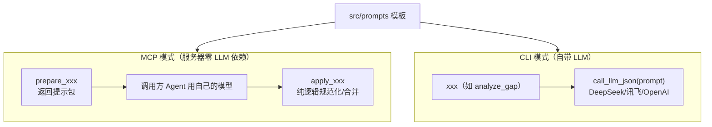

# 05 提示词与 LLM 适配器：双模式怎么落地

`src/prompts/` 存四套提示词模板，`src/utils/llm.py` 是统一 LLM 调用适配器。
两者合起来支撑"双模式"：MCP 模式把提示词包交给 Agent，CLI 模式自己调 LLM。

---

## 1. 四个提示词模板，各有什么设计意图

| 文件 | 用途 | 语言 | 核心约束 |
|------|------|------|----------|
| `enhance.py` | 语义复核 Top-N 命中 | 英文 | 只修 hit/miss，不得发明技能，重算 score |
| `gap_analysis.py` | 差距分析 + 学习路径 | 英文 | 缺失清单按输入顺序，学习路径 ≤8 步 |
| `modify.py` | 简历修改建议 | 中文 | 真实性红线 + AI 味词汇黑名单 |
| `resume_extract.py` | 简历 → 7 维画像 | 中文 | 逐字引用原文、≤30 字、未体现的维度留空 |

### 1.1 enhance.py：让 LLM 做"纠错员"

关键词匹配的误判需要语义纠正，提示词里写死了三条纪律：

1. 是真实命中，必须有简历证据（同义词、项目上下文、明确提及）；
2. 只允许从原始 miss 列表里补命中，**禁止发明原始数据里没有的技能**；
3. score 由服务器按「加权覆盖率 × 少条目惩罚」确定性重算，提示词里写明公式，
   并注明模型自报的 score 仅供参考、会被覆盖——模型只需保证 hit/miss 准确。

输出要求纯 JSON，schema 在提示词里完整给出——`apply_enhance_review` 就按这个
schema 解析。

### 1.2 gap_analysis.py：给 LLM 一份"半成品"而非"原材料"

这个提示词的设计哲学是**尽量少让模型自由发挥**：

- 命中明细（`dimension_details`）和缺失技能（`missing_sorted`）都是代码算好的，
  LLM 只需要判断 gap_level、写 summary、排学习路径；
- 明确要求缺失技能**按输入顺序输出**（权重降序），模型只负责标注 importance；
- 学习路径允许模型综合重要性 + 前置依赖重新排序（这是模型真正有增值的地方），
  但限制最多 8 步，且每步必须带 prerequisite / resources / estimated_effort / why。

输出是 7 维 JSON schema（`match` + `dimensions` + `missing_skills` +
`overall_summary` + `learning_path`），与 `build_gap_report` 的契约一一对应。

### 1.3 modify.py：中文 + 真实性红线

修改建议直接面向用户，所以提示词用中文、语气是"资深简历顾问"。关键设计：

- **任务边界**：是"针对性修改建议"，不是"重写整份简历"；
- **三态输出**：`hit`（已命中，教你怎么更显眼）/ `reinforce`（有基础但表述不足，
  给改写示例）/ `missing`（缺失：有可迁移经历才建议补充，否则**明确写"不建议
  写入"**）；
- **AI 味词汇黑名单**（`MODIFY_AI_PHRASES`）：把"赋能/抓手/闭环/打通/拉通/
  颗粒度/对齐/沉淀/落地..."映射成更朴素的说法，防止改出来的简历一股 AI 味。

```python
MODIFY_AI_PHRASES = {
    "赋能": "支持", "抓手": "切入点", "闭环": "完整流程",
    "打通": "整合", "拉通": "协调", ...
}
```

这个黑名单同时被提示词（让 LLM 避开）和纯逻辑校验（`edit_validation.py`
事后复查）使用——**同一份黑名单，两道防线**。

### 1.4 resume_extract.py：防幻觉从提示词就抓起

这份提示词由"JD 5 维胜任力提取"改造而来（5 维 → 7 维、提取对象从 JD 换成简历），
硬约束最多：

- 所有能力要素**逐字引用原文短语**，不得推断、补充、改写；
- 禁止添加"知识/能力/学历/技能"等类别词（"数据库设计与优化"不能变成
  "数据库设计与优化知识"）；
- 每项不超过 30 字；未体现的维度输出空数组；
- 只输出 JSON。

提示词里还带一个完整的示例（简历 → 提取结果），few-shot 让模型先看一遍
"原文短语 → 7 维归类"的标准动作。

## 2. LLM 适配器：src/utils/llm.py

### 2.1 并列 Switch 配置

```python
LLM_PROVIDERS = {
    "deepseek": {"label": "DeepSeek", "base_url": "https://api.deepseek.com/v1",
                 "default_model": "deepseek-chat"},
    "iflytek":  {"label": "讯飞星火", "base_url": "https://spark-api-open.xf-yun.com/v1",
                 "default_model": "4.0Ultra"},
    "openai":   {"label": "OpenAI",  "base_url": "https://api.openai.com/v1",
                 "default_model": "gpt-4o"},
    "custom":   {"label": "自定义",  "base_url": None, "default_model": None},
}
```

`get_llm_config` 只读**当前供应商的独立配置块**：

```python
provider = os.getenv("LLM_PROVIDER", "deepseek")
prefix = provider.upper() + "_"          # DEEPSEEK_ / IFLYTEK_ / OPENAI_ / CUSTOM_
api_key = os.getenv(prefix + "API_KEY")
base_url = os.getenv(prefix + "BASE_URL") or preset.get("base_url")
model = os.getenv(prefix + "MODEL") or preset.get("default_model")
```

这就是"并列 Switch"：每个供应商一块独立配置，切供应商只改 `LLM_PROVIDER`，
互不污染。`CUSTOM_*` 没有预设，三个字段（key/base_url/model）都必须显式配置。
`IFLYTEK_EXTRA_BODY` 等扩展 JSON 也会解析后透传给模型（讯飞推理模型开
thinking 用）。

### 2.2 统一走 OpenAI 兼容协议

```python
def build_chat_model(cfg, temperature=0.0):
    from langchain_openai import ChatOpenAI
    return ChatOpenAI(model=..., api_key=..., base_url=...,
                      temperature=temperature, timeout=..., max_retries=...)
```

DeepSeek / 讯飞 / OpenAI / 自定义全部是 OpenAI 兼容的 chat/completions 协议，
所以**一个 `ChatOpenAI` 通吃**。temperature 默认 0.0——结构化输出场景确定性优先。

### 2.3 容错三件套：call_llm_json

```python
def call_llm_json(prompt, temperature=0.0):
    response = llm.invoke(prompt)
    content = response.content.strip()
    if content.startswith("```"):           # 1. 剥掉 markdown 代码块
        content = content.split("\n", 1)[-1].rsplit("```", 1)[0].strip()
    try:
        return json.loads(content)
    except json.JSONDecodeError:
        return json.loads(_repair_json(content))   # 2. 修复后再试
```

`_repair_json` 处理常见问题：BOM、多余的尾部逗号、字符串里的控制字符、
被截断时按括号栈补全闭合。修不了才抛错，且报错信息带**错误位置附近 80 字符的
摘录**，方便排查。

## 3. 双模式对比：同一份提示词，两种用法



同一套模板：

- MCP 模式下，模板被塞进 `prepare_xxx` 的返回里（`{"mode", "prompt",
  "output_schema", "next_step"}`），Agent 照着 schema 输出，服务器只做
  合并/校验；
- CLI 模式下，模板直接作为 prompt 传给 `call_llm_json`，返回解析后的 JSON。

这就是为什么 MCP 模式不配 API Key 也能跑通全部工具——LLM 推理成本由调用方
Agent 承担。
