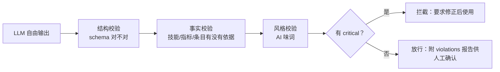

# 06 防造假与质量保障：为什么不会被 AI 带偏

这个项目让 LLM 干了三件"自由发挥"的事：复核命中、写差距分析、给修改建议。
自由发挥就有风险：**模型可能把简历里没有的技能写成"已命中"，可能建议用户编造
量化指标，可能让修改建议变成一段 AI 味浓重的套话。**

应对思路是**"提示词约束 + 纯逻辑校验"双保险**：提示词先在源头立规矩，纯逻辑
校验再在出口当安检。这一篇讲后者。

---

## 1. 三道防线的全景

| 防线 | 在哪 | 干什么 |
|------|------|--------|
| 提示词红线 | `src/prompts/modify.py` / `resume_extract.py` | 源头约束：不虚构、逐字引用、AI 味词回避 |
| 纯逻辑校验 | `src/core/edit_validation.py` + `resume_extract.py` 的 validate 函数 | 出口安检：技能地基、指标地基、来源核对 |
| 可审计输出 | `truncations` / `violations` / `review_note` | 留痕：超长截断、违规项、修正说明都能回溯 |

## 2. 修改建议防造假：edit_validation.py

入口是 `validate_edit_suggestions(role, resume_text, edit_json)`，返回：

```json
{
  "role_name": "...",
  "valid": true,
  "summary": "校验通过：8 条建议全部安全",
  "violations": [],
  "stats": {"suggestions": 8, "hit": 2, "reinforce": 3, "missing": 3, ...},
  "checklist": {"structure": true, "skill_grounding": true, ...}
}
```

六项检查逐个拆解：

### ① 结构校验

`suggestions` 必须是数组；每项必须有 `skill`、`status` 属于
`{hit, reinforce, missing}`、建议或改写不能同时为空。坏了直接给
`level: critical`，整个报告 `valid: false`。

### ② 技能地基：建议里的技能必须在岗位清单里

```python
universe = _role_skill_universe(role)   # 从 role.dimensions 汇总 hit ∪ miss
if skill not in universe["universe"]:
    violations.append("技能“X”不在岗位核心技能清单中")
```

防止 LLM 自己发明一个岗位根本不要求的技能来"凑建议"。

### ③ 状态一致性：hit/missing 要和命中明细对得上

```python
if status == "hit" and skill not in universe["hit"]:
    ...  # 标记已命中但实际不在命中清单 → warning
if status == "missing" and skill in universe["hit"]:
    ...  # 标记缺失但实际命中 → info
if status == "reinforce" and not _skill_in_text(skill, resume_text):
    ...  # 可强化但原文没体现 → warning
```

### ④ 指标地基：量化数字必须能在原文找到

```python
_METRIC_PATTERNS = [
    re.compile(r"\d+(?:\.\d+)?\s*[%％倍xXwW]"),                    # 30%、2倍
    re.compile(r"\d+(?:\.\d+)?\s*(?:ms|秒|分钟|小时|天|周|月|QPS|TPS|并发|万|亿|人|次|单|个|GB|MB|TB|G|M|K)"),
    re.compile(r"\d{3,}"),                                          # 三位以上数字
]
```

从建议/改写示例里提取所有量化指标，归一化后查原文：**原文没有的指标 = 疑似编造**
（warning）。这是直接打击"改简历最常见的造假方式——加个漂亮的数字"。

### ⑤ 新增技能风险：缺失技能被建议写入要格外小心

```python
has_negative = any(d in combined_text for d in _NEGATIVE_DIRECTIVE)  # 不建议/不要/避免...
has_add_intent = any(d in combined_text for d in _ADD_INTENT)        # 补充/添加/写入...
if (not _skill_in_text(skill, resume_text) and has_add_intent and not has_negative):
    ...  # critical：缺失技能被建议写入，但简历无依据，存在造假风险
```

注意它先识别**负向/条件表述**："不建议写入""除非有证据"这类句子不会被误判成
"建议造假"（只记 info）。

### ⑥ AI 味词汇复查

复用 `MODIFY_AI_PHRASES` 黑名单，命中就提示替换（info 级）。提示词让模型避开，
这里再兜底一遍——模型没听劝的时候，至少用户能看到警告。

### 严重度分级

```python
valid = critical_count == 0
```

- `critical`（0 容忍）：结构坏了 / 造技能 / 造假指标，必须修正后才能用；
- `warning`：需要人工确认（如"标记命中但原文未直接出现"，可能是语义命中）；
- `info`：提示性（AI 味词、负向表述识别）。

## 3. 画像提取防幻觉：validate_resume_profile

`resume_extract.py` 里的校验对**简历画像**做同样的事：

```python
def validate_resume_profile(profile, resume_text):
    for dim in DIMENSION_KEYS:
        # 1. 维度白名单：只有 7 个 key 合法
        # 2. 必须是字符串数组，无空条目
        # 3. 长度 ≤ 30 字
        # 4. 无重复条目
        # 5. 条目必须在原文有依据（_grounded）
    return {"ok": not violations, "violations": violations, "stats": {...}}
```

`_grounded` 的判定是核心：

```python
if len(item_norm) <= 4:
    return item_norm in text_norm       # 短词必须完整出现在原文
return any(text_norm.find(item_norm[i:i+4]) >= 0 for i in ...)  # 长词有连续 4 字窗口即可
```

这个设计的巧妙之处：**"数据库设计与优化" 和 "数据库设计与优化知识" 共享大量
连续子串 → 通过；而模型脑补的 "精通深度神经网络调参" 在原文里找不到任何
连续 4 字窗口 → 拦截**。既容忍轻度改写，又拦住完全虚构。

## 4. 复核合并的结构校验：check_review_structure

`review.py` 里还有一个轻量校验：复核 JSON 必须是 `{"results": [...]}`，
每项必须有 `role_name`。作用是在合并前拦住结构损坏的模型输出——LLM 偶尔会
丢字段、改 key，这时候 `apply_enhance_review` 直接拒绝，而不是拿半截数据硬算。

## 5. 这些校验共同守住的产品底线



一句话总结：**LLM 负责"聪明"，纯逻辑负责"可信"**。所有 LLM 输出都必须经过
确定性校验才能到达用户手里，而校验报告本身也返回给用户，让每个警告都可追溯。

