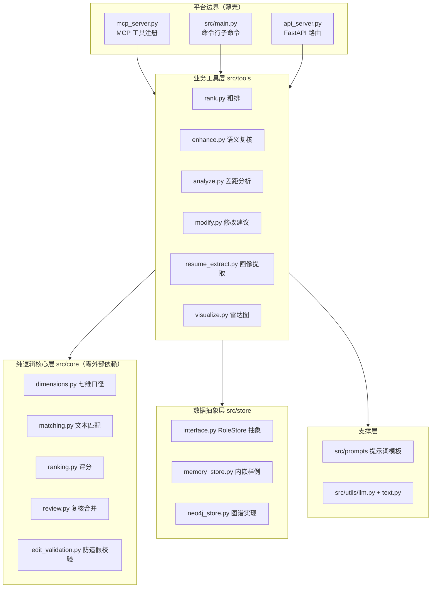
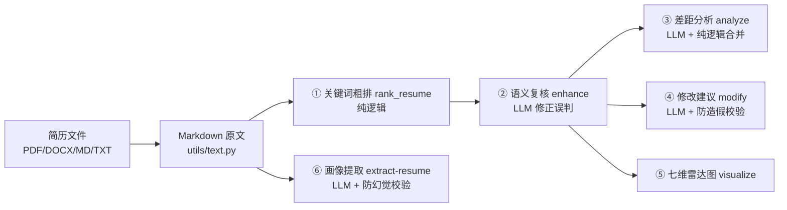

# 代码讲解 · 总览（先读这一篇）

这份指南面向"项目是 vibecoding 产物、想弄懂代码原理"的你。它不重复 API 文档
（那是 `docs/api.md` / `docs/gap-schema.md` 等接口契约），而是**顺着业务逻辑拆解
代码**：每一步在做什么、为什么这样做、数据长什么样、代码在哪里。

建议阅读顺序：

| 顺序 | 文档 | 讲什么 | 对应代码 |
|------|------|--------|----------|
| 0 | 本文 | 架构分层、业务流水线、设计决策 | 全项目 |
| 1 | [01 入口层](01-entry-points.md) | 三个入口怎么接入业务 | `mcp_server.py` / `src/main.py` / `api_server.py` |
| 2 | [02 数据层](02-data-layer.md) | 岗位数据从哪来 | `src/store/` |
| 3 | [03 核心匹配](03-core-matching.md) | 命中判定、打分公式、复核合并 | `src/core/` |
| 4 | [04 工具层业务流](04-tools-workflow.md) | 六步业务流水线 | `src/tools/` |
| 5 | [05 提示词与 LLM](05-prompts-and-llm.md) | 提示词模板 + LLM 适配器 + 双模式 | `src/prompts/` + `src/utils/llm.py` |
| 6 | [06 防造假与质量保障](06-quality-validation.md) | 为什么不会被 AI 带偏 | `src/core/edit_validation.py` 等 |

---

## 1. 项目一句话

给一份简历（PDF/DOCX/MD/TXT），先做**关键词命中粗排**找出最匹配的岗位，再用
**大模型做语义复核**修正误判，然后针对单个岗位输出**差距分析**、**学习路径**、
**简历修改建议**，最后渲染一张**七维雷达图**。此外还能把简历批量提取成
**7 维画像 JSON**，作为后续匹配的标准化输入。

## 2. 架构分层（核心心智模型）

代码刻意做了严格分层，越往下越"纯"（无外部依赖、可单测）：

三条依赖规则：

1. **平台边界只做"翻译"**：MCP / CLI / HTTP 入口都只负责把外部请求转成 Python
   调用、把结果序列化回去，不写任何业务逻辑。业务全部在 `src/tools/`。
2. **核心层零外部依赖**：`src/core/` 里的匹配、评分、校验都是纯函数，不联网、
   不 import neo4j、不调 LLM，所以 `tests/` 可以离线跑。
3. **数据层依赖倒置**：核心逻辑只认识 `RoleStore` 抽象接口，换数据源只改一个
   环境变量（`STORE_BACKEND`），匹配代码一行不用动。

## 3. 业务流水线（推荐按这个顺序读代码）

每一步对应的入口和产物：

| 步骤 | 业务动作 | 入口函数 | 产物 |
|------|----------|----------|------|
| 0 | PDF/DOCX → Markdown | `convert_to_markdown` | 简历文本 |
| 1 | 粗排 Top-N | `rank_resume` | `{topk, count, results[]}`，每个 role 含 score + 七维 hit/miss |
| 2 | 语义复核 | `prepare_enhance` / `apply_enhance_review` | 合并后的 results，带 `review_note` |
| 3 | 差距分析 + 学习路径 | `prepare_gap` / `analyze_gap` | Markdown 报告 + 结构化 `report` |
| 4 | 简历修改建议 | `prepare_resume_edit` / `validate_resume_edit` | 建议 JSON + 防造假报告 |
| 5 | 雷达图 | `visualize_radar` | PNG 图片 |
| 6 | 7 维画像提取 | `prepare_resume_extract` / `apply_resume_extract` | 标准化画像 JSON + 校验报告 |

## 4. 两个最重要的设计决策

### 4.1 七维口径是"宪法"

全项目的核心口径是 **7 维**：`knowledge / skill / qualifications / preference /
motivation / trait / self_concept`，严格对齐 Neo4j 图谱里
`NormalizedSkill.category` 的 7 个取值（知识/技术/任职条件/招聘偏好/动机/特质/
自我概念）。所有提示词、画像 schema、雷达图都是 7 维。

挑战杯大纲的"五分类"（知识/技术/动机/特质/自我概念）只是**原始数据/汇报口径**，
不参与核心匹配。如果对外材料需要五分类，用 `project_to_five_dim()` 做 7→5 投影
（任职条件 → 知识，招聘偏好 → 动机）。

这个"先定口径、勿摇摆"的决策，是为了让图谱数据、匹配逻辑、提示词、展示层
共享同一套 key，任何一层都不会出现对不上的维度名。

### 4.2 双模式：MCP 模式零 LLM 依赖

- **MCP 模式（Agent 调用）**：服务器只做纯逻辑——粗排、准备提示包、合并复核结果、
  渲染雷达图。语义复核 / 差距分析 / 简历修改等 LLM 推理由**调用方 Agent 自己的
  大模型**完成，服务器不调用任何外部 LLM API，因此**不需要 API Key**。
- **CLI 模式（命令行）**：`enhance` / `analyze` / `modify` / `extract-resume`
  通过统一 LLM 适配器（`src/utils/llm.py`）调用，默认 DeepSeek，可切讯飞 / OpenAI。

体现到代码上，`src/tools/` 里每个业务工具几乎都有"一对"函数：
`prepare_xxx`（MCP 用：拼提示包给 Agent）和 `xxx`（CLI 用：自己调 LLM）。
详见 [05 提示词与 LLM](05-prompts-and-llm.md)。

## 5. 一条数据的完整旅程（以粗排为例）

1. 用户把 `简历.pdf` 交给入口（MCP / CLI / HTTP）。
2. `src/utils/text.py` 用 markitdown 把 PDF 转成 Markdown 文本。
3. `rank_resume` 从 `store` 拿到全部岗位（内存样例或 Neo4j 图谱，结构相同）。
4. `src/core/ranking.py` 对每个岗位：把岗位的核心技能逐条在简历原文里做
   **归一化子串搜索**，得到命中/缺失；按"命中权重 / 总权重 × 少条目惩罚"
   算出分数，降序取 Top-N。
5. 对每个 Top-N 岗位再算一遍**七维命中明细**（每维的 hit/miss/coverage），
   组装成完整 JSON 返回。

后续每一步（复核、差距分析、修改建议）都消费这个 JSON 里的
`dimensions` 和 `skill_weights`，不再重新匹配——这就是"结构化命中清单"贯穿始终
的含义。

## 6. 十个常见疑问的快速答案

| 疑问 | 答案 |
|------|------|
| 粗排为什么不直接让大模型打分？ | 134 个岗位逐个让 LLM 打分成本高、速度慢；关键词粗排 O(N) 秒级出 Top-N，LLM 只复核前 20 名 |
| 分数是 LLM 算的吗？ | 不是。粗排分数是纯逻辑算的；复核合并后也由 `review.py` **确定性重算**，不信任模型自报数字 |
| 为什么有"少条目惩罚"？ | 防止只有 3 条核心技能的岗位因为命中率高而无脑排前 |
| 学历怎么匹配？ | 特判：按等级比较（博士 > 硕士 > 本科 > 大专），而不是子串包含 |
| 为什么核心层不 import neo4j？ | 依赖倒置：数据源可替换，测试零依赖，核心逻辑可离线单测 |
| MCP 模式要 API Key 吗？ | 不要。服务器只做纯逻辑，LLM 推理在调用方 Agent 侧 |
| 修改建议怎么防造假？ | 三道防线：提示词红线 + 纯逻辑校验（技能地基/指标地基/AI 味词汇）+ 校验报告 |
| 画像提取怎么防幻觉？ | `_grounded` 检查条目必须能在原文找到连续字面依据，超 30 字自动截断并留审计记录 |
| 全角/半角、标点差异怎么办？ | 统一归一化：去空白标点、全角转半角、转小写后再匹配 |
| 旧代码在哪？ | `archive/legacy/`（Streamlit/LangGraph 版）已隔离，不参与运行 |

